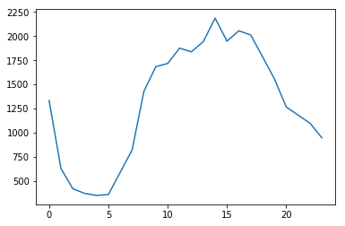
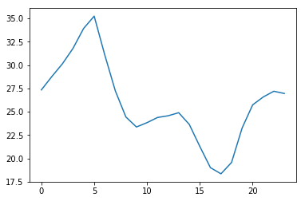
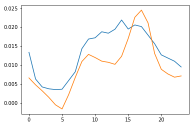
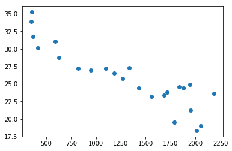
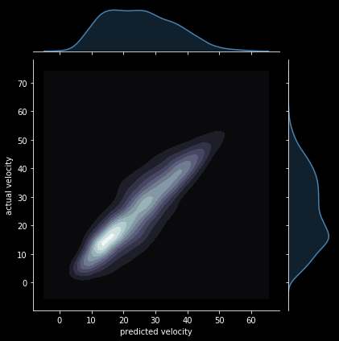

```python
import osmnx as ox
import pandas as pd
from matplotlib import pyplot as plt
import seaborn as sns
import numpy as np
import networkx as nx
from sklearn.externals import joblib
from sklearn.ensemble import RandomForestRegressor
import scipy
```


```python
import os
from sodapy import Socrata
```


```python
G = ox.graph_from_place('Manhattan Island, New York City, New York, USA', network_type='drive',simplify=True)

```


```python
#get relevant collisions & speeds data from 2018
```


```python
query = """
select *

where
date<'2019-01-01T00:00:00.000'
and
date>='2018-01-01T00:00:00.000'

and
borough='MANHATTAN'


limit
    50000000000
"""
```


```python
#SQL querying collisions data from Socrata
client = Socrata("data.cityofnewyork.us", None)
results = client.get("qiz3-axqb", query=query)

# Convert to pandas DataFrame
results_df = pd.DataFrame.from_records(results)
```

    WARNING:root:Requests made without an app_token will be subject to strict throttling limits.
    


```python
query = """
select *

where
data_as_of<'2019-01-01T00:00:00.000'
and
data_as_of>='2018-01-01T00:00:00.000'
and
borough='Manhattan'
and
speed is not null
and
link_points is not null


limit
    50000000000
"""
```


```python
#now for speeds data from Socrata again
client = Socrata("data.cityofnewyork.us", None)
#results = client.get("i4gi-tjb9", where="data_as_of='2017-10-19T06:58:30.000'",limit=2000000)
results = client.get("i4gi-tjb9", query=query)

# Convert to pandas DataFrame
results_df2 = pd.DataFrame.from_records(results)
```

    WARNING:root:Requests made without an app_token will be subject to strict throttling limits.
    


```python
df_speeds=results_df2.copy()
df_coll=results_df.copy()
```


```python
#converting everything to proper date time format
```


```python
df_coll['datetime']=pd.to_datetime(df_coll['date'].astype(str)+' '+df_coll['time'].astype(str))
df_speeds['datetime']=pd.to_datetime(df_speeds['data_as_of'])
```


```python
df_coll['hour']=df_coll['datetime'].dt.hour
df_speeds['hour']=df_speeds['datetime'].dt.hour
df_speeds['speed']=np.array(df_speeds['speed'].values,dtype=float)
df_speeds=df_speeds.loc[df_speeds['speed']>0]
```


```python
df_speeds['hm']=df_speeds['hour']*60+df_speeds['datetime'].dt.minute
df_coll['hm']=df_coll['hour']*60+df_coll['datetime'].dt.minute
df_coll['dateonly']=df_coll['datetime'].dt.date
df_speeds['dateonly']=df_speeds['datetime'].dt.date
df_speeds['weekday']=df_speeds['datetime'].dt.dayofweek
df_coll['weekday']=df_coll['datetime'].dt.dayofweek

```


```python
#Exploratory analysis to see if collision rate (collisions/hour) is correlated with speed
```


```python
plt.plot(df_coll.groupby(['hour']).size())

```


    [<matplotlib.lines.Line2D at 0x23d912800f0>]





```python
plt.plot(df_speeds.groupby(['hour'])['speed'].mean())
```


    [<matplotlib.lines.Line2D at 0x23d7fe7ab70>]





```python
#some rough scaling- so that they fit on the same graph 
plt.plot(.00001*df_coll.groupby(['hour']).size())
plt.plot(-.03+1/df_speeds.groupby(['hour'])['speed'].mean())
#we are seeing that 1/speed and collision rate definitely look correlated!
```


    [<matplotlib.lines.Line2D at 0x23d7fea3dd8>]





```python
plt.plot(df_coll.groupby(['hour']).size(),df_speeds.groupby(['hour'])['speed'].mean(),'o')
#nice correlation! More collisions at times of day when speeds are lower
```


    [<matplotlib.lines.Line2D at 0x23d7fef9b38>]





```python
#Now looking at entire data set - how well can speed be predicted/ do collisions help in predicting speed?
#grouping dataset by hour and date
```


```python
grouped_df=df_coll.groupby(['hour','dateonly'])
df_coll_rate=pd.DataFrame(grouped_df.size().reset_index(name = "Coll_rate"))
```


```python
df_speeds_coll = pd.merge(df_speeds, df_coll_rate,  how='left', left_on=['hour','dateonly'], right_on = ['hour','dateonly'])
```


```python
data=df_speeds_coll[['hm','id','weekday','Coll_rate']]
data['speed']=df_speeds_coll['speed']
data=data.dropna()
features=data[['hm','id','weekday','Coll_rate']]
labels=data['speed']
```

    C:\Users\Skanda\Anaconda3\lib\site-packages\ipykernel_launcher.py:2: SettingWithCopyWarning: 
    A value is trying to be set on a copy of a slice from a DataFrame.
    Try using .loc[row_indexer,col_indexer] = value instead
    
    See the caveats in the documentation: http://pandas.pydata.org/pandas-docs/stable/indexing.html#indexing-view-versus-copy
      
    


```python
rf = RandomForestRegressor()
#lr_regressor= GridSearchCV(lr,parameters)
rf.fit(features,labels)
```


```python
pred=rf.predict(features)

```


```python
slope, intercept, r_value, p_value, std_err = scipy.stats.linregress(pred,labels.values)
r_value**2

```


    0.72848483376827444


```python
w=np.where(pred<60)[0]
pred2=pred[w]
labels2=labels.values[w]
a1=np.linspace(0,len(pred2)-1,len(pred2)).astype(int)
np.random.shuffle(a1)
pred3=pred2[a1[:10000]]
labels3=labels2[a1[:10000]]


jointplotdata=pd.DataFrame({'predicted velocity':pred3,'actual velocity':labels3})

```


```python
len(data)
```


    2077757


```python
# r squared 0.73 with collisions, 0.66 without collisions
```


```python
fig=plt.figure()
with plt.style.context('dark_background'):
    #with plt.style.context('seaborn-pastel'):
    kdefig=sns.jointplot(x="predicted velocity",y='actual velocity',data=jointplotdata,kind='kde',cmap='bone',color='steelblue')
    #hexplot = sns.jointplot(x, y, kind="hex")
    #plt.subplots_adjust(left=0.2, right=0.8, top=0.8, bottom=0.2)  # shrink fig so cbar is visible
    #cax = kdefig.fig.add_axes([.85, .25, .05, .4])  # x, y, width, height
    #plt.colorbar(cax=cax)
    
    #plt.xlim(0,50)
    #plt.ylim(0,50)
    plt.savefig('vel-pred-coll2.pdf')
```


    <Figure size 432x288 with 0 Axes>





```python
#now looking at a particular day: 1-2-2018
```


```python
df_speeds_coll_1218=df_speeds_coll.loc[df_speeds_coll['datetime'].dt.date==pd.to_datetime('2018-01-02').date()]

```


```python
df_speeds_coll_1218=df_speeds_coll_1218[['hm','id','weekday','Coll_rate','speed','link_points','hour']]
```


```python
df_speeds_coll_1218=df_speeds_coll_1218.dropna()
```


```python
data=df_speeds_coll_1218[['hm','id','weekday','Coll_rate']]
data['speed']=df_speeds_coll_1218['speed']
features=data[['hm','id','weekday','Coll_rate']]
labels=data['speed']
```


```python
pred=rf.predict(features)
slope, intercept, r_value, p_value, std_err = scipy.stats.linregress(pred,labels.values)
r_value**2
df_speeds_coll_1218['speed_pred']=pred
```


```python
r_value**2

```


    0.81554425440785172


```python
df_speeds_coll_1218['speed_pred']=pred
```


```python
df_speeds_coll_1218.head()
```


<div>
<style scoped>
    .dataframe tbody tr th:only-of-type {
        vertical-align: middle;
    }

    .dataframe tbody tr th {
        vertical-align: top;
    }

    .dataframe thead th {
        text-align: right;
    }
</style>
<table border="1" class="dataframe">
  <thead>
    <tr style="text-align: right;">
      <th></th>
      <th>hm</th>
      <th>id</th>
      <th>weekday</th>
      <th>Coll_rate</th>
      <th>speed</th>
      <th>link_points</th>
      <th>hour</th>
      <th>speed_pred</th>
    </tr>
  </thead>
  <tbody>
    <tr>
      <th>6674</th>
      <td>2</td>
      <td>448</td>
      <td>1</td>
      <td>2.0</td>
      <td>42.87</td>
      <td>40.77149,-73.99423 40.7719,-73.99401 40.77481,...</td>
      <td>0</td>
      <td>41.309048</td>
    </tr>
    <tr>
      <th>6675</th>
      <td>2</td>
      <td>364</td>
      <td>1</td>
      <td>2.0</td>
      <td>29.82</td>
      <td>40.745726,-73.97359 40.745616,-73.97305 40.745...</td>
      <td>0</td>
      <td>27.666750</td>
    </tr>
    <tr>
      <th>6676</th>
      <td>2</td>
      <td>119</td>
      <td>1</td>
      <td>2.0</td>
      <td>37.90</td>
      <td>40.70631,-74.01501 40.705380,-74.01528 40.7049...</td>
      <td>0</td>
      <td>35.652139</td>
    </tr>
    <tr>
      <th>6677</th>
      <td>2</td>
      <td>124</td>
      <td>1</td>
      <td>2.0</td>
      <td>41.01</td>
      <td>40.68036,-74.00441001 40.6822,-74.0057201 40.6...</td>
      <td>0</td>
      <td>12.389750</td>
    </tr>
    <tr>
      <th>6678</th>
      <td>2</td>
      <td>445</td>
      <td>1</td>
      <td>2.0</td>
      <td>17.39</td>
      <td>40.7262006,-74.01112 40.7252805,-74.01128 40.7...</td>
      <td>0</td>
      <td>15.243000</td>
    </tr>
  </tbody>
</table>
</div>


```python
df_speeds_coll_1218.to_csv('df_speeds_coll_1218',index=False)
```


```python
#now for Open Street Maps stuff!
```


```python
df_speeds_coll_1218['id']=np.array(df_speeds_coll_1218.id.values,dtype=int)
```


```python

grouped_df=df_speeds_coll_1218.groupby(['link_points'])
df_id_lp=pd.DataFrame(grouped_df.mean().reset_index())
```


```python
len(df_speeds_coll_1218['hour'])/24
```


    219.54166666666666


```python
grouped_df=df_speeds_coll_1218.groupby(['link_points','hour'])
df_speeds_coll_1218_g=pd.DataFrame(grouped_df.mean().reset_index())
```


```python
len(df_speeds_coll_1218_g)
```


    446


```python
dfNodes = df_speeds_coll_1218_g[['id', 'link_points']]
manhattan=G
```


```python
len(idNodes)
```


    4779


```python
# Splitting the column containing all Lat/Long combinations
dfNodes['splitPoints'] = dfNodes['link_points'].apply(lambda x: x.split(' '))

# Reshaping our data frame to have a row for each Lat/Long point
idNodes = []
for x,y in zip(dfNodes['splitPoints'], dfNodes['id']):
    for a in np.arange(len(x)):
        idNodes.append((y, x[a]))
dfNodes = pd.DataFrame(idNodes, columns=['id', 'LatLong'])

dfNodes = dfNodes.replace('', np.NaN).dropna()

# Parsing Lat/Long into individual columns
# Longitude has an if statement since some records contain '-' for longitude
dfNodes['Latitude'] = dfNodes['LatLong'].apply(lambda x: x.split(',')[0])
dfNodes['Longitude'] = dfNodes['LatLong'] \
    .apply(lambda x: x.split(',')[1] if len(x.split(',')) > 1 else None)

# Dropping incorrect longitude records and converting everything to floats
dfNodes = dfNodes[dfNodes['Longitude'] != '-'][['id', 'Latitude', 'Longitude']].astype(float)

# Obtaining the nearest nodes in the network from the Lat/Long points
nodes = []
for row in dfNodes.iterrows():
    nearest_node = ox.get_nearest_node(manhattan, (dfNodes['Latitude'].ix[row], 
                                                   dfNodes['Longitude'].ix[row]))
    nodes.append(nearest_node)
dfNodes['Node'] = nodes

# Removing duplicate nodes
dfNodes.drop_duplicates(subset='Node', inplace=True)

dfNodes.head()
```

    C:\Users\Skanda\Anaconda3\lib\site-packages\ipykernel_launcher.py:2: SettingWithCopyWarning: 
    A value is trying to be set on a copy of a slice from a DataFrame.
    Try using .loc[row_indexer,col_indexer] = value instead
    
    See the caveats in the documentation: http://pandas.pydata.org/pandas-docs/stable/indexing.html#indexing-view-versus-copy
      
    C:\Users\Skanda\Anaconda3\lib\site-packages\ipykernel_launcher.py:24: DeprecationWarning: 
    .ix is deprecated. Please use
    .loc for label based indexing or
    .iloc for positional indexing
    
    See the documentation here:
    http://pandas.pydata.org/pandas-docs/stable/indexing.html#ix-indexer-is-deprecated
    C:\Users\Skanda\Anaconda3\lib\site-packages\ipykernel_launcher.py:25: DeprecationWarning: 
    .ix is deprecated. Please use
    .loc for label based indexing or
    .iloc for positional indexing
    
    See the documentation here:
    http://pandas.pydata.org/pandas-docs/stable/indexing.html#ix-indexer-is-deprecated
    C:\Users\Skanda\Anaconda3\lib\site-packages\osmnx\utils.py:382: RuntimeWarning: invalid value encountered in minimum
      h = np.minimum(1.0, h) # protect against floating point errors
    


<div>
<style scoped>
    .dataframe tbody tr th:only-of-type {
        vertical-align: middle;
    }

    .dataframe tbody tr th {
        vertical-align: top;
    }

    .dataframe thead th {
        text-align: right;
    }
</style>
<table border="1" class="dataframe">
  <thead>
    <tr style="text-align: right;">
      <th></th>
      <th>id</th>
      <th>Latitude</th>
      <th>Longitude</th>
      <th>Node</th>
    </tr>
  </thead>
  <tbody>
    <tr>
      <th>0</th>
      <td>124.0</td>
      <td>40.680360</td>
      <td>-74.00441</td>
      <td>4.145735e+09</td>
    </tr>
    <tr>
      <th>2</th>
      <td>124.0</td>
      <td>40.683700</td>
      <td>-74.00644</td>
      <td>3.708807e+08</td>
    </tr>
    <tr>
      <th>4</th>
      <td>124.0</td>
      <td>40.694120</td>
      <td>-74.01288</td>
      <td>6.079114e+08</td>
    </tr>
    <tr>
      <th>7</th>
      <td>124.0</td>
      <td>40.703434</td>
      <td>-74.01561</td>
      <td>4.244435e+07</td>
    </tr>
    <tr>
      <th>8</th>
      <td>124.0</td>
      <td>40.704990</td>
      <td>-74.01519</td>
      <td>5.885468e+08</td>
    </tr>
  </tbody>
</table>
</div>


```python
len(np.unique(df_speeds_coll_1218_g['id'].values))
```


    24


```python
#trying....
```


```python
df=df_speeds_coll_1218_g.loc[df_speeds_coll_1218_g['hour']==16]
df['id'] = df['id'].astype(float)
df['id'] = df['id'].astype(float)
df = df.merge(dfNodes, on ='id')
len(df)
```

    C:\Users\Skanda\Anaconda3\lib\site-packages\ipykernel_launcher.py:2: SettingWithCopyWarning: 
    A value is trying to be set on a copy of a slice from a DataFrame.
    Try using .loc[row_indexer,col_indexer] = value instead
    
    See the caveats in the documentation: http://pandas.pydata.org/pandas-docs/stable/indexing.html#indexing-view-versus-copy
      
    C:\Users\Skanda\Anaconda3\lib\site-packages\ipykernel_launcher.py:3: SettingWithCopyWarning: 
    A value is trying to be set on a copy of a slice from a DataFrame.
    Try using .loc[row_indexer,col_indexer] = value instead
    
    See the caveats in the documentation: http://pandas.pydata.org/pandas-docs/stable/indexing.html#indexing-view-versus-copy
      This is separate from the ipykernel package so we can avoid doing imports until
    


    154


```python

```


```python

        # Merging in the nodes
df['id'] = df['id'].astype(float)  # Converting for the merge
df = df.merge(dfNodes, on ='id')

        # Mapping the nodes to speed categories
df['speed'] = df['speed'].astype(float)
slow = []
medium = []
fast = []
for row in df.iterrows():
    speed = df['speed'].ix[row]
    node = df['Node'].ix[row]
    

```

    C:\Users\Skanda\Anaconda3\lib\site-packages\ipykernel_launcher.py:12: DeprecationWarning: 
    .ix is deprecated. Please use
    .loc for label based indexing or
    .iloc for positional indexing
    
    See the documentation here:
    http://pandas.pydata.org/pandas-docs/stable/indexing.html#ix-indexer-is-deprecated
      if sys.path[0] == '':
    C:\Users\Skanda\Anaconda3\lib\site-packages\ipykernel_launcher.py:13: DeprecationWarning: 
    .ix is deprecated. Please use
    .loc for label based indexing or
    .iloc for positional indexing
    
    See the documentation here:
    http://pandas.pydata.org/pandas-docs/stable/indexing.html#ix-indexer-is-deprecated
      del sys.path[0]
    


```python
            # Speeds in MPH
    if speed >= 40:
        fast.append(node)
    if speed < 40 and speed >= 20:
        medium.append(node)
    if speed < 20:
        slow.append(node)
        
        # Setting the node color based on the speed categories
nc = ['g' if node in fast
        else ('y' if node in medium
        else ('r' if node in slow 
        else 'None'))
        for node in manhattan.nodes()]

        # Timestamp

        # Plotting the map
        #fig, ax = ox.plot_graph(manhattan_projected, fig_height=10, node_size=8, 
         #                       node_alpha=1,edge_linewidth=0.2, dpi=100, node_color=nc)
```


```python
fig, ax = ox.plot_graph(manhattan_projected, fig_height=10, node_size=8, 
         #                       node_alpha=1,edge_linewidth=0.2, dpi=100, node_color=nc)
```
